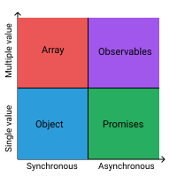
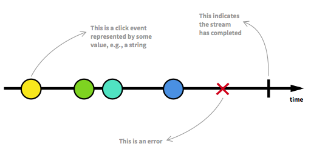
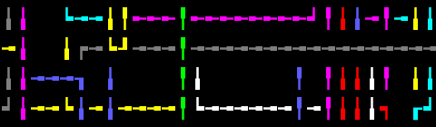

# RxJS

Through out my career I had the opportunity to work with and awesome tool like rxjs, first introduce to me in the angular ecosystem, and then it was a nice library to help in react projects. The following is an article with an introduction to the nice parts of RxJs.

[Yeah well honestly with RxJS the benefit is t... - DEV](https://dev.to/ladyleet/comment/2k4a)

> *"(...)with RxJS the benefit is that you are moving your business logic into a domain specific language - so it's much easier to copy/paste code into new frameworks and libraries without large rewrites. You're also essentially future proofing your code two ways. The first is - RxJS provides an abstraction in the form of Observable for you so that you can easily change out the inputs at a later time. The second is - later on, it's much easier to add on functionality by just adding on another operator or chaining together a set of things, again, without having to rewrite your code much(...)"*
> 

Source:  [RxJS core team member AM](https://dev.to/ladyleet/im-tracy-lee-a-rxjs-core-team-member-and-google-developer-expert-ask-me-anything-42jo)

RxJS is an implementation of the [ReactiveX](http://reactivex.io/) library for javascript. The main objective of the library is to offer a way **to transform, query and compose asynchronous/event-based sources**. As Tracy Lee (RxJS core team member) states, the library is great to bring a **domain-specific language** to developers. Furthermore, it brings to the table great abstraction and an easier option to handle asynchronous code than the current javascript options.

### Recomended Resources

[learnrxjs.io](https://www.learnrxjs.io/)

[reactivex.io](http://reactivex.io/intro.html)

[rxmarbles](https://rxmarbles.com/)

# Why RxJS

Nowadays the common problems of scalability and latency had grown exponentially due to the number of events and data that our javascript programs have to manage to give the best possible interactive UI/UX. There are methods and libraries that try to manage that complexity. For example, callbacks have been mostly used to manage remote source data from endpoints, but this pattern has failed to manage all the problems that managing remote data involves. (2017: Daniels)

## Reactive programming

RxJS its meant to be a solution that follows functional reactive programming to solve **asynchronous data manipulation**. For example, callbacks are a solution to synchronous data management. This solution tries to make **non-blocking code possible** in a way ****that provides a handling way to manage asynchronous code. 

### Callbacks

In the code below, we can see an example of *callback hell.* As we can see, lots of nested functions were put in place to manage different endpoints calls. This makes code unreadable and of course, does not lead to write code in a declarative way.

```jsx
$.ajax({
    url: "http://example.com",
    complete: function() {
        console.log("STOP");
        $.ajax({
            url: "http://example.com",
            complete: function() {
                console.log("THIS");
                $.ajax({
                    url: "http://example.com",
                    complete: function() {
                        console.log("MAD");
                        $.ajax({
                            url: "http://example.com",
                            complete: function() {
                                console.log("MAN!");
                            }
                        })
                    }
                })
            }
        })
    }
})
```

Some of the common drawbacks about callbacks are:

- [Callbacks can run more than once](https://www.codereadability.com/preventing-a-callback-from-accidentally-being-called-twice/)
- Concurrency becomes complicated
- Callback Hell
- Error handling semantics get lost

### Promises

Javascript ES6 introduced another alternative to handle asynchronous code. Promises handle callbacks in a more declarative way in order to give a sense of sequence in  asynchronous operations. This final idea can be sum up with the concept of *continuation*(Rauschmayer:2012)

```jsx
somePromise()
  .then(data => console.log(data))
  .catch(err => console.error(err))
```



Promises solve many raw callbacks drawbacks because they are similar to handling synchronous code, but the only support handling a **single value** throws the flow. So this is where RxJS comes to action. In the following image we can see that observables offer a way to handle multiple values in an asynchronous way, but what is an **observable?** It's an abstraction that can be thought of as an array,  but with the capability of change**,** that means it can **emit different values over time.** 

### Streams

> A stream is a sequence of ongoing events ordered in time. It can be anything like user inputs, button clicks or data structures. (2018: Gavhane)
> 

The concept of stream refers to any kind of event, like an api new data, a button click(s), etc. Conceptually, streams emit a value, an error and complete signal.  Commonly, a stream its represented as a bunch of values over an arrow (Representing time).



[Image  from: Andre Staltz, *The introduction to Reactive Programming you've been missing*](https://gist.github.com/staltz/868e7e9bc2a7b8c1f754#file-zclickstream-png)

<aside>
💡 An important initiative, is the [design marble system](https://github.com/BioPhoton/Rx-Marble-Design-System) that it's a framework to standardize the visualization of functional reactive programming.

</aside>

An  stream is composed by

- Producer: sources of your data and starting point. The [observer pattern](https://en.wikipedia.org/wiki/Observer_pattern) defines produces as *subject,* in RxJS they are called **observables**
- Consumer: Defined as observer. In RxJS the observers are going to listen through a *subscription* with the `subscribe()` method.
- Data pipeline: When we pass data from a producer to a consumer we are able to manipulate the data. In RxJS data can be manipulated through *observable operators,* that are similar to the array methods  `map()`, `filter()`  for example.
- Time

## 1. Observables

Observables are an important concept in RxJS. They can be thinks as: 

- As **arrays** that are constructed in a period of time.
- They represent a stream, a collection of values, a source of data that arrive over time
- A mere function that takes and observer (the object that listens to values ​​delivered by observables)

There are plenty of ways to create or define an observable. In the example below, we can see two ways to define them. The first one with the `create()` . With this method, a couple of values are emitted to the subscriber through `next()` inside the arrow function. In the second example, we use `of()` to define an observable from a string value. Then we use the `map()` operator to modify the value of the observable with string interpolation, so the subscriber gets the modified value below.

 

```jsx
import { of, Observable } from 'rxjs'; 
import { map } from 'rxjs/operators';

// First way with create method
const observable = Observable.create( observer => {
    observer.next( 'Hello' )
    observer.next( 'World!' )
})

observable.subscribe(val => console.log(val))
// hello
// world

// Second way from raw values with the of()
const source = of('World').pipe(
  map(x => `Hello ${x}!`)
);

source.subscribe(x => console.log(x));
// Hello World!
```

### #from ajax

```jsx
import { ajax } from 'rxjs/ajax';

const someLifeAdvice= `https://api.adviceslip.com/advice`;

const advice= ajax(someLifeAdvice);

const subscribe = advice.subscribe(
  res => console.log(res),
  err => console.error(err)
);

/* Output Possible Advice

{
   "slip":{
      "advice":"Don't give a speech. Put on a show.",
      "slip_id":"58"
   }
}
```

### # from DOM event

```jsx
const clicks = fromEvent(document, 'click')

+ clicks.subscribe(console.log) // Sames as .subscribe(click => console.log(click))
- clicks..subscribe(click => console.log(click))
// If you click a browser page
// MouseEvent {isTrusted: true}
// MouseEvent {isTrusted: true}
```

### # from Promise

```jsx
import { from } from 'rxjs';

const promise = new Promise((resolve, reject) => { 
    setTimeout(() => {
        resolve('resolved!')
    }, 1000)
});
//get observable from promise
const obsvPromise  = from(promise);

//when whe subscribe to the observable, we will listen to the values emitted
//output: resolved!
obsvPromise.subscribe(result => console.log(result))
```

[https://stackblitz.com/edit/rxjs-x8vqpc?embed=1&file=index.ts](https://stackblitz.com/edit/rxjs-x8vqpc?embed=1&file=index.ts)

## 2. Hot and Cold Observables

You can think of this two concept in the following wasy:

**Cold observables**: Can only have **one** or a **single** subscription. You can think for example that a youtube video is a cold observable since a single person can see the video at its own pace, so every viewer sees a single instance of the video. Cold observables just **emit values** when **something subscribes** to them, or in this case when someone actually searches and plays a youtube video

**Hot Observables:** **multicast** values, so they are like live youtube video steaming where people only watch the video from the part where the live video is.

To get a deeper explanation of these concepts you can check [Hot vs Cold observables](https://medium.com/@benlesh/hot-vs-cold-observables-f8094ed53339), a core RxJS team member post.

Cold observable example:

([CodeSandbox](https://codesandbox.io/embed/rxjscold-o06t6?expanddevtools=1&fontsize=14&module=%2Fsrc%2Findex.ts))

```jsx
import { Observable } from 'rxjs';

const cold = Observable.create(observer => observer.next(Math.random()));

cold.subscribe(console.log);
cold.subscribe(console.log);

//Output two different random values/numbers
// 0.1653200587
// 0.8224698752

```

By moving the source of the value outside the observable creation, we can make the observable hot

([CodeSandbox](https://codesandbox.io/embed/rxjshot-f52gu?expanddevtools=1&fontsize=14&module=%2Fsrc%2Findex.ts))

```jsx
import { Observable } from 'rxjs';

randomNumber = Math.random()
const cold = Observable.create(observer => {
  observer.next(randomNumber)
});

hot.subscribe(console.log);
hot.subscribe(console.log);

//Output the same shared value
// 0.1653200587
// 0.1653200587
```

We can convert a cold observable into a hot one by calling `publish()` . With this method, we can share a source by then calling the `connect()` . So from the cold observable example, we can have a hot observable as following

([CodeSandBox](https://codesandbox.io/embed/rxjscold-r52cg?expanddevtools=1&fontsize=14&module=%2Fsrc%2Findex.ts))

```jsx
import { Observable } from 'rxjs';

const cold = Observable.create(observer => observer.next(Math.random()));

const hot = cold.publish();

cold.subscribe(console.log);
cold.subscribe(console.log);

hot.connect()

//Output the same shared value
// 0.1653200587
// 0.1653200587
```

<aside>
💡 [publish](https://rxjs.dev/api/operators/publish) 📜 official docs

</aside>

## 3. Subjects

RxJS lends us a special type of Observable that acts as an event emitter because permits values to be [multicasted](https://en.wikipedia.org/wiki/Multicast). Remember that plain observables are unicast, so instead of converting our cold observables to hot observables, we can use subjects to resolve our use cases.

<aside>
💡 Subjects act like **observables** and **observers** as the **same time,** since you can subscribe to a Subject and also you can send values to a subject since it implements `next()`, `error()` and `complete()` methods

</aside>

```jsx
import { Subject } from 'rxjs';

const subject = new Subject();

subject.subscribe(console.log);// logs 1st Value, 2nd Value

subject.next('1st Value');
subject.next('2nd Value');

subject.subscribe(console.log); // logs 3rd Value, 4th Value

subject.next('3rd Value');
subject.next('4th Value');

subject.subscribe(console.log); // Doesn't log anything

```

This example show how subject multicast the values emitted through `next()` method. We can notice that the second subscription will not be logged since for plain subjects each new observer starts receiving the next generated values, r~~emember just like a [Twitch](https://www.twitch.tv/), [facebook](https://www.facebook.com/facebookmedia/solutions/facebook-live) or [youtube](https://www.youtube.com/channel/UC4R8DWoMoI7CAwX8_LjQHig) live stream.~~

There are other few types of subjects like: ***Behavior subject, Replay subject and Async Subject***

### Behavior Subject

The behavior subject emits a first value and its capable of emit one previous value to a second subscriber. Its like if the behavior subject had a buffer of size one

```jsx
import { Subject, BehaviorSubject } from 'rxjs';

const behaviorSubject = new BehaviorSubject('1st value');

behaviorSubject .subscribe(console.log);// prints: 1st value , 2nd value

behaviorSubject .next('2nd value');

behaviorSubject .subscribe(console.log); // prints one previous value: 2nd value
```

## 4. Operators (Most Popular ones) 🌊

You must noticed that to transform certain values emitted by observables we used some methods like `map()` for example. Those methods are called operators. You can think of operators of different kind of tubes that modify the water flow in a pipe system. ~~Yes we know that this example is overly used but it  fulfills its didactic task especially for beginners.~~



### Map

The map operator applies a function to each emitter value by an observable

([codesandbox](https://codesandbox.io/embed/rxjshot-00k8d?expanddevtools=1&fontsize=14&module=%2Fsrc%2Findex.ts))

```jsx
import { range } from "rxjs";
import { map } from "rxjs/operators";

const obvs = range(0, 10)
.pipe(map(value => console.log(value + 5)));

obvs.subscribe();
// the values emitted should be: 5,6,7,8,9,10,11,12,13,14
```

This observable gets the first 10 (starting from [0,9] ) numbers and adds them a value of 5.

### Filter

([codesandbox](https://codesandbox.io/embed/rxjsmap-operator-0wdcj?expanddevtools=1&fontsize=14&module=%2Fsrc%2Findex.ts))

```jsx
//[learnrxjs.io](https://www.learnrxjs.io/operators/filtering/%27../recipes/%27../recipes/save-indicator.md) example
import { interval } from 'rxjs';
import { filter } from 'rxjs/operators';

//emit every second
const source = interval(1000);
//filter out all values until interval is greater than 5
const example = source.pipe(filter(num => num > 5));
/*
  "Number greater than 5: 6"
  "Number greater than 5: 7"
  "Number greater than 5: 8"
  "Number greater than 5: 9"
*/
const subscribe = example.subscribe(val =>
  console.log(`Number greater than 5: ${val}`)
);
```

The filtering operators pass emitted values to a provided condition. this is really helpful when accepting or denying certain items is important. We will see later that this operators are going to help with the concept of **[backpressure](https://github.com/Reactive-Extensions/RxJS/blob/master/doc/gettingstarted/backpressure.md)**

<aside>
🔥 You can find more filtering operators [**here**](https://www.learnrxjs.io/operators/filtering/)

</aside>

### Take

The most basic example of `take()` operator would be to console.log the first number of an array of numbers:

```jsx
// learnrxjs.io example
import { of } from 'rxjs';
import { take } from 'rxjs/operators';

//emit 1,2,3,4,5
const source = of(1, 2, 3, 4, 5);
//take the first emitted value then complete
const example = source.pipe(take(1));
//output: 1
const subscribe = example.subscribe(val => console.log(val));
```

Until now we have used the operators to show some independent examples of how to use them. In the following one we can see a common counter example to see how we can combine operators:

[https://stackblitz.com/edit/basic-counter?embed=1&file=index.js&hideExplorer=1](https://stackblitz.com/edit/basic-counter?embed=1&file=index.js&hideExplorer=1)

We are basically showing a stopwatch counter that shows in the page when we click start and pause buttons. We use the `map()` operator to show the milliseconds correctly and we add a `takeUntil()` operator that its a variaton of the `take()` operator.

### Scan

The **impatient** `reduce()`(yes, similar to the `[array.prototype.reduce()](https://developer.mozilla.org/en-US/docs/Web/JavaScript/Reference/Global_Objects/Array/reduce)`) operator. This operator rushes to show every emitted value in a stream.

```jsx
import { merge } from 'rxjs';
import { scan } from 'rxjs/operators';
import { ajax } from 'rxjs/ajax';

let progressBar = document.querySelector('.progress-bar');
let arrayOfRequests = [];
let endpoint = 'https://aws.random.cat/meow';
for (let i = 0; i < 128; i++) {
  arrayOfRequests.push(ajax(endpoint));
}

merge(...arrayOfRequests)
  .pipe(scan(prev => prev + 100 / arrayOfRequests.length, 0))
  .subscribe(percentDone => {
    progressBar.style.width = percentDone + '%';
    progressBar.innerText = Math.round(percentDone) + '%';
  });
```

With scan we can calculate the progress of the requests since scan captures every event emitted.

## 5. Debugging observable streams

In the previous examples we have seen the use of `.subscribe(console.log)` to print the observables streams. The problem with that it's that we only can see the result at the end of the pipe and not while its been flattened or reduced for example. In the following examples we will show three operators that might be useful for debbuging purposes.

### Tap

([codesandbox](https://codesandbox.io/embed/rxjsscan-operator-wzwz0?expanddevtools=1&fontsize=14&module=%2Fsrc%2Findex.ts))

```jsx
import { range } from "rxjs";
import { map, tap } from "rxjs/operators";

const observable$ = range(0, 10);

const debbugged$ = observable.pipe(
  tap(val => console.log(`First tappey 🍺 ${val}`)),
  map(v => v + 5),
  tap(v => console.log(`Seccond tap 🍻 ${v * 2}`)),
  map(v => v * 2),
  tap(console.log)
);

debbugged$.subscribe();
```

As we can see, between `map()` operations we insert `tap()` in order to log the values before and after they have have been modified.

<aside>
🚨 The tap operator was introduced in version six till in previous ones the `do()` operator was the one used as **tap**. The change occurred since do its a reserved word in javascript.

</aside>

### toArray

toArray is really useful to store the resultant emitted values in a stream. We should be carefull since its waits an stream to complete, so its a good option to use it with operators like 

```jsx
import { fromEvent } from "rxjs";
import { take, toArray } from "rxjs/operators";

fromEvent(someButton, 'click')
  .pipe(
    take(3),
    toArray()
  )
  .subscribe(console.log);
```

### Repeat

We can use repeat value to have the observable values as many times desired in order to check how our code is modifying the values and check if that's what we intend.

```jsx
import { range, of } from "rxjs";
import { delay, repeat } from "rxjs/operators";

range(0,3)
  .pipe(
    delay(1000),
    repeat(3)
  )
  .subscribe(console.log);
```

## 6. Backpressure

> *Backpressure occurs when your consumer is slower than your producer. [RxJs docs](https://github.com/Reactive-Extensions/RxJS/blob/master/doc/gettingstarted/backpressure.md)*
> 

As stated in the docs, backpressure refers to when there are more way events(mouse movements, input typing, etc) than the consumers can handle. RxJS bring us some instruments as operators and strategies to attack this problem. To refer to these mechanisms we call them lossy and lossless methods.

**Losless backpressure** refers to when we want to keep the data transmitted as the upload of an image or some file we want to process. Instead, user input events like input [typeahead](https://en.wikipedia.org/wiki/Typeahead) are **lossy** because  we can control the data transmission through operations that are very helpful to batch the data from time to time or pause and restart data streaming between actions.

In the following example, we can appreciate how we get in the console all the mouse movement positions, so we are going to take this as an example of a lossy backpressure where we get more than what we can process.

### Debounce

([codesandbox](https://codesandbox.io/embed/rxjstap-operator-vm83n?expanddevtools=1&fontsize=14&module=%2Fsrc%2Findex.ts))

```jsx
//Fireship.io [RxJs concepts](https://fireship.io/lessons/rxjs-basic-pro-tips/)

import { fromEvent } from 'rxjs';
import { map } from 'rxjs/operators';

const event = fromEvent(document, 'mousemove').pipe(
  map(event => {
    return `X: ${event.clientX} Y: ${event.clientY} 💩`     
  })
);

event.subscribe(console.log)
```

To aliviate this we could use the `debounceTime()` operator to wait some time before we start listening the mousemove events. So now we will see that the logging in the console take more time between values. We should notice that all **the values that are between the logged values** or to be more specific, the **values that take less** than the 1000 ms specified as input, are **lost** or **discarded.** Move the mouse around and after one second that we stop moving the position will be logged.

```jsx
//Fireship.io [RxJs concepts](https://fireship.io/lessons/rxjs-basic-pro-tips/)

import { fromEvent } from 'rxjs';
import { map } from 'rxjs/operators';

const event$ = fromEvent(document, 'mousemove').pipe(
  map(event => {
    return `X: ${event.clientX} Y: ${event.clientY} 💩`     
  })
);

const debounced$ = event.pipe(debounceTime(1000));

debounced$.subscribe(console.log);
```

This strategy is perfect to handle the typeahead kind of use cases where it's better to make backend API call after the user stops typing, so we don't make an API call every time a character is typed

### Throttling

Other approach to handle lossy backpressure is throttling. The `throttleTime` method emits the **first** value between a certain time. For example, we will see in the console one value emitted per second

([codesandbox](https://codesandbox.io/embed/rxjsdebounce-qc6i2?expanddevtools=1&fontsize=14&module=%2Fsrc%2Findex.ts))

```jsx
import { fromEvent } from "rxjs";
import { map, throttleTime } from "rxjs/operators";

const event$ = fromEvent(document, "mousemove").pipe(
  map(event => {
    return `X: ${event.clientX} Y: ${event.clientY} 💩`;
  })
);

const throttled$ = event.pipe(throttleTime(1000));

throttled$.subscribe(console.log);
```

### Buffer

Buffering allows grouping emitted values depending if we select to group them by time, but number of values or by toggle events. 

`bufferCount(bufferSize:number, startBufferEvery:number)` will start to group the emmited values in arrays of two values. If you notice the grouped values will not be overlaped since bufferSize = StartBufferEvery 

([codesandbox](https://codesandbox.io/embed/rxjsthrottle-0ogkq?expanddevtools=1&fontsize=14&module=%2Fsrc%2Findex.ts))

```jsx
import { timer } from "rxjs";
import { bufferCount } from "rxjs/operators";

const sourceInterval$ = timer(0, 1000); //emit value every second

const buffered$ = sourceInterval$.pipe(bufferCount(2));// equival to bufferCount(2,2)

buffered$.subscribe(console.log);
```

If for example whe change the bufferSize > startBufferEvery, the values emmited in the arrays will be overlaped

([codesandbox](https://codesandbox.io/embed/rxjsbuffercount1-vl6x3?expanddevtools=1&fontsize=14&hidenavigation=1&module=%2Fsrc%2Findex.ts))

```jsx
import { timer } from "rxjs";
import { bufferCount } from "rxjs/operators";

const sourceInterval$ = timer(0, 1000); //emit value every second

const buffered$ = sourceInterval$.pipe(bufferCount(3, 2));

buffered$.subscribe(console.log);
```

There are other for buffering as plain `[buffer](https://www.learnrxjs.io/operators/transformation/buffer.html)`, or `[bufferTime](https://www.learnrxjs.io/operators/transformation/buffertime.html)`. Take a look to those ones as in [learnrxjs.io](http://learnrxjs.io) are great examples of usage.

## 7. Observable Flattening

Flattening solves the problem of observables that emit other observables. A common example is the URL observable

<aside>
💡 *High - order observables* are the ones that emit other observables

</aside>

```jsx
import { from } from 'rxjs';
import { map } from 'rxjs/operators';
import { ajax } from 'rxjs/ajax'

let input$ = from(['url1', 'url2', 'url3']);
let output$ = input$.pipe(map((url) => ajax(url)));

output$.subscribe((innerObservable$) => {
  innerObservable$.subscribe((data) => console.log(data))
})
```

So the problem with this its that we will need to subscribe separately to each inner observable and the code will start to look like **callback hell. To avoid this problem a much easier solution would be to use the** `mergeAll()` operator

<aside>
💡 First Order observables are the ones that emit values

</aside>

```jsx
import { from } from 'rxjs';
import { map,mergeAll } from 'rxjs/operators';
import { ajax } from 'rxjs/ajax'

let input$ = from(['url1', 'url2', 'url3']);
let output$ = input$.pipe(
  map(url => ajax(url)),
  mergeAll()
);
output$.subscribe(data => console.log(data));

```

With this we would just need to subscribe to the outer observable (output$) , because behind the scenes `mergeAll` its subscribes to **all** inner observables and remit the values to the outer observable. 

We could also use switching, so with the `switchAll` if we are only interested in the last emitted value for example. A third possibility it's to use concatenation with `concatAll` operator, that will emit the inner observable values in sequence.

<aside>
💡 Flattening operators allow to **convert** *high- order observables* **into** *firt-order* observables

</aside>

### SwitchMap

Switching concept its very useful, so are the switching operators like `switchMap`.You can think as this operator it's the combination of `map` + `switchAll`. It's very common to use the operator to avoid race conditions like in a typeahead or autocomplete use cases. Chaining two different HTTP requests that are related it's another user case

```jsx
import { of } from 'rxjs'; 
import { switchMap } from 'rxjs/operators';

const genre$ = of({ genreID: 'Horror1' });

const books$ = genre$.pipe(
    switchMap(genre => {
        // return an Observable or Promise here
        return fetch(`http://.../books/${user.genreID}`)
    })
)

books$.subscribe(console.log);
// Logs response from the API
```

For example to we can implement a search input to check for certain posts in [dev.to](http://dev.to) in order to test the `switchMap` operator

([codesandbox](https://codesandbox.io/embed/rxjsflattening-05nur?expanddevtools=1&fontsize=14&module=%2Fsrc%2Findex.ts))

```tsx
import { fromEvent, merge, of } from "rxjs";
import { ajax } from "rxjs/ajax";
import {
  map,
  filter,
  distinctUntilChanged,
  debounceTime,
  tap,
  switchMap,
  catchError
} from "rxjs/operators";

let endpoint = `https://dev.to/api/articles?tag=`;
let searchBar = document.querySelector<HTMLElement>("input");
let resultsArea = document.querySelector<HTMLElement>(".results");
let loadingEl = document.querySelector<HTMLElement>(".loader");

function displayResults(results) {
  resultsArea.innerHTML = "";
  let listEl = document.createElement("ul");
  results.forEach(question => {
    let li = document.createElement("li");
    let a = document.createElement("a");
    a.href = question.link;
    a.innerHTML = question.title;
    li.appendChild(a);
    listEl.appendChild(li);
  });
  resultsArea.appendChild(listEl);
}

fromEvent<any>(searchBar, "keyup")
  .pipe(
    map(event => event.target.value),
    - filter(query => query.length > 3),
    - debounceTime(333),
    tap(() => (loadingEl.style.display = "block")),
    switchMap(query => ajax(endpoint + query)),
    catchError((err, caught$) => merge(of({ err }), caught$)),
    tap(() => (loadingEl.style.display = "none"))
  )
  .subscribe(
    function updatePageOrErr(results: any) {
      if (results.err) {
        alert(results.err);
      } else {
        displayResults(results.response);
      }
    },
    err => alert(err.message)
  );
```

```html
<div id="app">
	<div class="container">
      <div class="row">
        <div class="col-xs-6 col-xs-offset-3">
          <div class="text-center">
            <h1>Search Dev.to by tag</h1>
            <input type="text" class="form-control">
            <h3 class="loader">Loading...</h3>
            <div class="results"></div>
          </div>
        </div>
      </div>
    </div>	
</div>
```

We should avoid nested subscriptions, so thats why we should user operators, in this case `switchMap(query => ajax(endpoint + query))` will get the job done, but we could improve that code by filtering so
the word that's in the input has at least 4 words and debouncing to wait some millisenods before start listening to the input changes.

There is one operator that we are going to follow up in the next section that is `catchError` so we can handle errors smoothly. We also encourage you to try to
explore some other operators that could be helpful in this case like `distinctUntilChanged()` and take a look to `contatMap`, `mergeMap` and `exhaustMap` and some of their use cases [Real World RxJS use cases.](https://www.slideshare.net/ladyleet/rxjs-operators-real-world-use-cases-angularmix)

## 8. Combination

<aside>
💡 "The combination operators allow the joining of information from multiple observables. Order, time, and structure of emitted values is the primary variation among these operators." [learnrxjs.io](https://www.learnrxjs.io/operators/combination/)

</aside>

This functions allow to combine some
series of observables. Commom;y combination functions receive
observables as input and return observables that at the end are going to emit an array with values. One of the most used function to combine
observables is `combineLatest`.

([codesandbox](https://codesandbox.io/embed/rxjscold-i19ux?expanddevtools=1&fontsize=14&module=%2Fsrc%2Findex.ts))

```jsx
import { combineLatest, interval } from "rxjs";
import { map } from "rxjs/operators";

let counter1 = 0;
let counter2 = 1;

const firstCounter$ = interval(5000).pipe(
  map(() => {
    console.log(`Source1: ${counter1}`);
    return counter1++;
  })
);

const secondCounter$ = interval(5000).pipe(
  map(() => {
    console.log(`Source1: ${counter2}`);
    return counter2++;
  })
);

const combined = combineLatest(firstCounter$, secondCounter$);

combined.subscribe(val => console.log(`combine latest emits: ${val}`));
```

In the example we can see that theresultant observable emits an array with the latest values emitted by
the counter observables(`firstCounter$, secondCounter$`). We should consider that combineLatest will start emitting the array only if one of the input values emits at least one value.

A common use case of this function are cascade filtering where we need to wait to two
comboboxes or thow checkboxes to be checked in order to make a backend
call. Here we can find the [most popular and used combination functions and operators](https://www.learnrxjs.io/operators/combination/).

## 9. Error Handling

To control the error and notshow to the user any exception that could result from a backend call for examplet, RxJS provide the `catchError` operator. Following the previous switchMap section example, we could add error handling after the ajax calls we make to the dev.to API.

([codesandbox](https://codesandbox.io/embed/rxjsswitchmap-bwih7?expanddevtools=1&fontsize=14&module=%2Fsrc%2Findex.ts))

```jsx
import { fromEvent, merge, of } from "rxjs";
import { ajax } from "rxjs/ajax";
import { map, tap, switchMap, catchError, take } from "rxjs/operators";

let endpoint = `https://dev.to/api/articles?tag=`;
let searchBar = document.querySelector<HTMLElement>("input");
let resultsArea = document.querySelector<HTMLElement>(".results");
let loadingEl = document.querySelector<HTMLElement>(".loader");

function displayResults(results) {
  resultsArea.innerHTML = "";
  let listEl = document.createElement("ul");
  results.forEach(question => {
    let li = document.createElement("li");
    let a = document.createElement("a");
    a.href = question.link;
    a.innerHTML = question.title;
    li.appendChild(a);
    listEl.appendChild(li);
  });
  resultsArea.appendChild(listEl);
}

fromEvent<any>(searchBar, "keyup")
  .pipe(
    map(event => {
      if (event.target.value === "throw error") {
        throw "💥 Booom an error!";
      }
      return event.target.value;
    }),
    //filter(query => query.length > 3),
    //debounceTime(333),
    tap(() => (loadingEl.style.display = "block")),
    switchMap(query => ajax(endpoint + query)),
    catchError(err => of({ err: "Something went wrong, try again" })),
    tap(() => (loadingEl.style.display = "none"))
  )
  .subscribe(
    function updatePageOrErr(results: any) {
      if (results.err) {
        alert(results.err);
      } else {
        displayResults(results.response);
      }
    },
    err => alert(err.message)
  );
```

In this example we can see that in the line 36 we added the operator to handle some exception in the observable pipeline, so with this, when we type throw error in the input text, it will generate show in an alert the text "Something went wrong, try again". If we wouldn't have this error operator the alert would show an undefined text that doesn't say anything to the user.

<aside>
💡 After `catchError` operator we can try to add the `retry` that it's very useful when we make API calls

</aside>

## 10. Memory leaks

It's important to not forget to discard those observables that we don't need anymore, so we can have a performant application and a good usage of memory and CPU. We could do the following to unsubscribe from a observable.

([fireship.io](https://github.com/fireship-io/175-code-this-not-that-rxjs/blob/master/src/10-unsubscribe.js))

```jsx
//Fireship.io
import { interval } from "rxjs";

const source = interval(100);

const subscription = source.subscribe(value => {
  console.log(value);
  if (value >= 10) {
    subscription.unsubscribe();
  }
});
```

We can improve this by using some filtering operators so we can manage the unsubscription internally. So if we use takeWhile operator we can achieve the same result because the observable will stop emitting values when the observable reaches the condition.

```jsx
import { interval, timer } from "rxjs";
import { takeLast, takeWhile, takeUntil } from "rxjs/operators";

const source = interval(100);

const example = source.pipe(
  takeWhile(v => v <= 10)
);

example.subscribe(console.log);
```

There are many ways to manage the memory in RxJS, we are going to see in following documents that unsubscribe will have greater protagonism when we use it with some framework lifle cycle hook to try to improve our applications.

## References

Daniels, P. P., & Atencio, L. (2017). *RxJS in action: Covers RxJS 5*. Shelter Island: Manning.

Rauschmayer, A. (n.d.). *Asynchronous programming and continuation-passing style in JavaScript.* Retrieved July 17, 2019, from [https://2ality.com/2012/06/continuation-passing-style.html](https://2ality.com/2012/06/continuation-passing-style.html)

Delaney, J. (nd) Rxj: Quickstart with 20 examples Retrieved August 27, 2019 , from [https://angularfirebase.com/lessons/rxjs-quickstart-with-20-examples/](https://angularfirebase.com/lessons/rxjs-quickstart-with-20-examples/)

[https://coursetro.com/courses/25/A-Comprehensive-RxJS-Tutorial---Learn-ReactiveX-for-JavaScript-](https://coursetro.com/courses/25/A-Comprehensive-RxJS-Tutorial---Learn-ReactiveX-for-JavaScript-)

[RxJS Observables Tutorial - Creating & Subscribing to Observables](https://coursetro.com/posts/code/148/RxJS-Observables-Tutorial---Creating-&-Subscribing-to-Observables)

[Angular: Facades + RxJS!](https://blog.angularindepth.com/angular-you-may-not-need-ngrx-e80546cc56ee)

Gavhane, S. (2018, September 30) Reactive Programming in JavaScript with RxJS. Retrieved from: [https://dev.to/sagar/reactive-programming-in-javascript-with-rxjs-4jom](https://dev.to/sagar/reactive-programming-in-javascript-with-rxjs-4jom)

## References

Daniels, P. P., & Atencio, L. (2017). *RxJS in action: Covers RxJS 5*. Shelter Island: Manning.

Rauschmayer, A. (n.d.). *Asynchronous programming and continuation-passing style in JavaScript.* Retrieved July 17, 2019, from [https://2ality.com/2012/06/continuation-passing-style.html](https://2ality.com/2012/06/continuation-passing-style.html)

[Randall Koutnik](https://learning.oreilly.com/search/?query=author%3A%22Randall%20Koutnik%22&sort=relevance&highlight=true) Koutnik, Randall (2018 )[Build Reactive websites with RxJS](https://www.oreilly.com/library/view/build-reactive-websites/9781680506495/). OReilly, Retrieved August, 2019, from

Poshtaruk, O(2018) [Hands on RxJS for Web development Retrieved](https://www.oreilly.com/library/view/hands-on-rxjs-for/9781788838429/). OReilly, retrieved August 20, 2019, from https://github.com/PacktPublishing/Hands-on-RxJS-for-Web-development

Gavhane, S. (2018, September 30) Reactive Programming in JavaScript with RxJS. Retrieved from: [https://dev.to/sagar/reactive-programming-in-javascript-with-rxjs-4jom](https://dev.to/sagar/reactive-programming-in-javascript-with-rxjs-4jom)

Delaney, J. (nd) Rxj: Quickstart with 20 examples Retrieved August 27, 2019 , from [https://angularfirebase.com/lessons/rxjs-quickstart-with-20-examples/](https://angularfirebase.com/lessons/rxjs-quickstart-with-20-examples/)

[Top 10 RxJS concepts](https://fireship.io/lessons/rxjs-basic-pro-tips/)

[Learn ReactiveX for JavaScript](https://coursetro.com/courses/25/A-Comprehensive-RxJS-Tutorial---Learn-ReactiveX-for-JavaScript-)

[RxJS Observables Tutorial - Creating & Subscribing to Observables](https://coursetro.com/posts/code/148/RxJS-Observables-Tutorial---Creating-&-Subscribing-to-Observables)

[Angular: Facades + RxJS!](https://blog.angularindepth.com/angular-you-may-not-need-ngrx-e80546cc56ee)